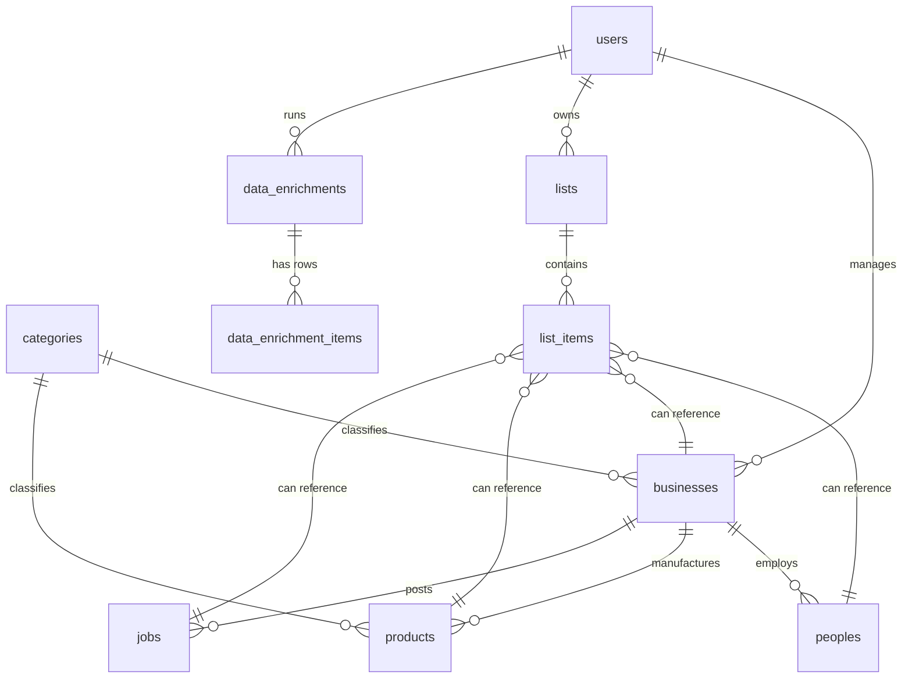

# SoukNet Directory Database Schema Proposal

This document outlines the proposed database schema design to support **People**, **Companies (Businesses)**, **Products**, **Jobs**, **Lists**, and **Data Enrichments** within the SoukNet directory application. It builds on the existing tables (`users`, `businesses`, `categories`, etc.).

---

## 1. Entity Relationship Diagram

---

## 2. Table Specifications

### A. Existing Table Context
* **`users`**: Contains core authentication profiles.
* **`businesses`**: Acts as **Companies**. Already contains name, category, website, location, contacts, and custom details.

---

### B. New Table: `peoples` (Contacts/Leads)
Stores profiles of individuals, usually linked to a company (Business).

| Column Name | Type | Constraints | Description |
| :--- | :--- | :--- | :--- |
| `id` | BigInt | Primary Key, Auto Increment | Unique record identifier. |
| `business_id` | BigInt | Foreign Key (`businesses.id`), Nullable | The company where they work. |
| `first_name` | String(100) | Not Null | Given name. |
| `last_name` | String(100) | Not Null | Family name. |
| `title` | String(150) | Nullable | Job title (e.g., "Developer", "CEO"). |
| `email` | String(255) | Unique, Nullable | Direct verified email address. |
| `phone` | String(50) | Nullable | Direct dial/work phone. |
| `location` | String(255) | Nullable | City, state, or country. |
| `linkedin_url` | String(255) | Nullable | Professional network URL. |
| `github_url` | String(255) | Nullable | developer profile link. |
| `is_verified` | Boolean | Default `false` | Contact verified status flag. |
| `timestamps` | Timestamps | - | Created/Updated timestamps. |

---

### C. New Table: `products`
Associated with manufacturing/supplier businesses.

| Column Name | Type | Constraints | Description |
| :--- | :--- | :--- | :--- |
| `id` | BigInt | Primary Key, Auto Increment | Unique record identifier. |
| `business_id` | BigInt | Foreign Key (`businesses.id`), Cascades | Manufacturer / Provider. |
| `category_id` | BigInt | Foreign Key (`categories.id`), Nullable | Specific product classification. |
| `name` | String(255) | Not Null | Product/Machinery name. |
| `slug` | String(255) | Unique, Not Null | URL friendly slug identifier. |
| `price_monthly_cents`| Integer | Default `0` | Price if offered as subscription (optional). |
| `price_cents` | Integer | Nullable | Purchase price in cents. If null, "Request Quote". |
| `specs` | JSON / Text | Nullable | Technical specifications (e.g., `{"power": "5.5kW", "voltage": "380V"}`). |
| `image_color` | String(50) | Nullable | Gradient UI fallback (e.g. `from-slate-700 to-slate-900`). |
| `type` | Enum / String | Default `small` | Options: `machinery`, `manufacture`, `small`. |
| `is_active` | Boolean | Default `true` | Directory listing visibility state. |
| `timestamps` | Timestamps | - | Created/Updated timestamps. |

---

### D. New Table: `jobs`
Job listings posted by companies.

| Column Name | Type | Constraints | Description |
| :--- | :--- | :--- | :--- |
| `id` | BigInt | Primary Key, Auto Increment | Unique job listing identifier. |
| `business_id` | BigInt | Foreign Key (`businesses.id`), Cascades | Posting business. |
| `title` | String(255) | Not Null | Job title (e.g., "Senior Laravel Developer"). |
| `slug` | String(255) | Unique, Not Null | URL identifier. |
| `location` | String(255) | Not Null | Job location text (e.g., "Algiers (Hybrid)"). |
| `salary_min` | Integer | Nullable | Minimum salary range. |
| `salary_max` | Integer | Nullable | Maximum salary range. |
| `salary_currency` | String(3) | Default `'USD'` | e.g. `'DZD'`, `'USD'`. |
| `type` | Enum / String | Default `'Full-time'` | Options: `Full-time`, `Part-time`, `Contract`, `Remote`. |
| `experience` | Enum / String | Default `'mid'` | Options: `entry`, `mid`, `senior`. |
| `tags` | JSON / Text | Nullable | Array of tech stack keywords. |
| `description` | Text | Nullable | Job duties and requirements. |
| `is_active` | Boolean | Default `true` | Visibility flag. |
| `timestamps` | Timestamps | - | Created/Updated timestamps. |

---

### E. New Tables: Lists (`lists` and Polymorphic `list_items`)
Enables users to build custom segments of people, companies, jobs, etc.

#### Table: `lists`
| Column Name | Type | Constraints | Description |
| :--- | :--- | :--- | :--- |
| `id` | BigInt | Primary Key, Auto Increment | Unique list identifier. |
| `user_id` | BigInt | Foreign Key (`users.id`), Cascades | Owner of the list. |
| `name` | String(255) | Not Null | Name of the list (e.g. "Tech Leads 2026"). |
| `type` | String(50) | Default `'people'` | Targets: `people`, `businesses`, `products`, `jobs`. |
| `description` | Text | Nullable | Optional notes. |
| `timestamps` | Timestamps | - | Created/Updated timestamps. |

#### Table: `list_items` (Polymorphic Pivot)
| Column Name | Type | Constraints | Description |
| :--- | :--- | :--- | :--- |
| `id` | BigInt | Primary Key, Auto Increment | Record identifier. |
| `list_id` | BigInt | Foreign Key (`lists.id`), Cascades | Parent list. |
| `listable_type` | String(255) | Not Null | Target Model class (e.g., `App\Models\People`, `App\Models\Business`). |
| `listable_id` | BigInt | Not Null | Target Model ID reference. |
| `timestamps` | Timestamps | - | Created/Updated timestamps. |

---

### F. New Tables: Data Enrichment (`data_enrichments` & `data_enrichment_items`)
Tracks uploaded CSV/paste batches and matches.

#### Table: `data_enrichments`
| Column Name | Type | Constraints | Description |
| :--- | :--- | :--- | :--- |
| `id` | BigInt | Primary Key, Auto Increment | Enrichment task batch ID. |
| `user_id` | BigInt | Foreign Key (`users.id`), Cascades | Executed by user. |
| `type` | Enum / String | Not Null | Target domain: `contacts` or `companies`. |
| `status` | String(20) | Default `'pending'` | State: `pending`, `processing`, `success`, `failed`. |
| `file_name` | String(255) | Nullable | Uploaded CSV name (if any). |
| `credits_spent` | Integer | Default `0` | Charged amount from account balance. |
| `timestamps` | Timestamps | - | Created/Updated timestamps. |

#### Table: `data_enrichment_items`
| Column Name | Type | Constraints | Description |
| :--- | :--- | :--- | :--- |
| `id` | BigInt | Primary Key, Auto Increment | Individual query record ID. |
| `data_enrichment_id`| BigInt | Foreign Key (`data_enrichments.id`), Cascades | Parent batch. |
| `input_query` | String(255) | Not Null | Email or Domain query input (e.g., `farhan@laravel.com`). |
| `status` | String(20) | Default `'pending'` | Match state: `pending`, `success`, `failed`. |
| `matched_model_type`| String(255) | Nullable | Associated target class (e.g. `App\Models\People`). |
| `matched_model_id`  | BigInt | Nullable | Target ID matching the directory database. |
| `enriched_payload` | JSON | Nullable | Discovered data properties fallback cache. |
| `timestamps` | Timestamps | - | Created/Updated timestamps. |
